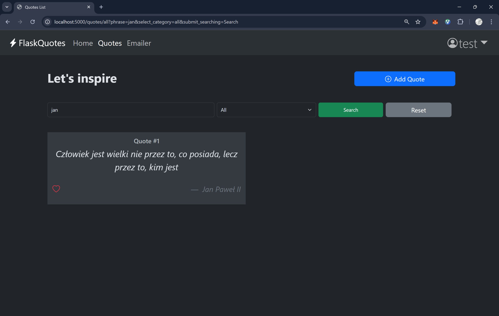

# QuoteApp – Inspirational Quotes Web App

A Flask-powered web application that allows users to browse, add, and manage motivational and philosophical quotes. Featuring a sleek UI, email reminders, and personalized content.

---

## Features

- Daily email reminders with motivational quotes at the time selected by the user realised with using Flask-Mail, Celery i Celery Beat

- Like and save your favorite quotes to view them later

- Add your own quotes with author, category, and visibility settings

- Search and filter quotes by content, author name, or category

- Browse only liked quotes, your own quotes, or all public ones

- Private/public quote visibility — share quotes or keep them personal

- Customizable quote categories for email and browsing filters

- Secure password hashing using Flask-Security / Werkzeug (never stored in plain text)

- User authentication system (login, registration, session management)

- Form validation with Flask-WTF to ensure clean user input

- Access control — only logged-in users can like or add quotes

- Clean and responsive UI using Bootstrap 5 for smooth UX

- Environment configuration via .env files for flexibility

- Docker-ready setup (optional) for deployment in containerized environments

- Reset filters easily with one click while browsing quotes

- Modular Flask structure (Blueprints, Models, Forms, Routes, etc.)

- Flask-Migration logs and files used

- Deployable on platforms like Render, Railway, Fly.io, Heroku, or VPS

---

## Screenshots

---

## Tech Stack

- Python 3.11, Flask, SQLAlchemy
- Flask-WTF, Flask-Mail, Flask-Login, Flask-Migration
- Bootstrap 5, HTML5, Jinja2
- SQLite (or PostgreSQL in production)

---
